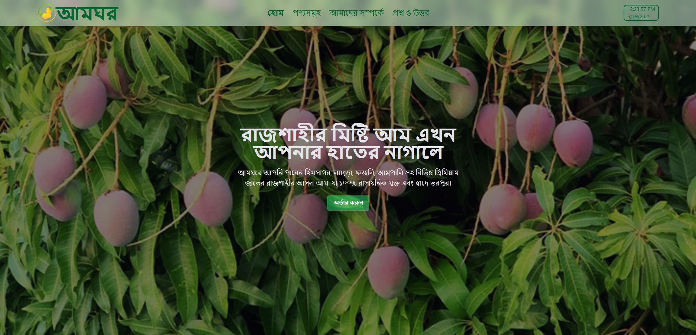

## 👤 ডেভেলপার

- নাম: **Tonmoy Sarker**
- রোল : 03
- ইমেইল: tonmoycsebd@gmail.com
- ওয়েবসাইট: www.tonmoysarker.com


# 🍋 আমঘর (AmGhor) - রাজশাহীর খাঁটি আমের বাজার

**আমঘর** একটি আধুনিক ওয়েবসাইট, যেখানে রাজশাহীর খাঁটি, রাসায়নিকমুক্ত আম অনলাইনে অর্ডার করা যায়। এই প্রজেক্টটি HTML, Tailwind CSS এবং DaisyUI ব্যবহার করে তৈরি করা হয়েছে। এটি সম্পূর্ণভাবে রেসপনসিভ ও মোবাইল-বান্ধব।

---

## 🔗 লাইভ প্রিভিউ (Live Preview)
[🔗 ক্লিক করুন লাইভ সাইট দেখতে](https://amghor.tonmoysarker.com)

---

## 📁 প্রজেক্ট স্ট্রাকচার

```bash
amghor/
│
├── index.html               # হোমপেজ
├── style.css                # কাস্টম স্টাইল (যদি থাকে)
├── /Pages/                  # অন্যান্য পেজ যেমন about, faq, products
│   ├── about.html
│   ├── product.html
│   └── faq.html
├── /assets/                 # ইমেজ ও মিডিয়া ফাইল
│   ├── s1.jpg
│   ├── app.png
│   └── ...
└── README.md                # এই ফাইল
```

---

## 🛠️ টেকনোলজি ও টুলস

- ✅ **HTML5**
- ✅ **Tailwind CSS (CDN)**
- ✅ **DaisyUI (for components)**
- ✅ **Vanilla JavaScript** (for time/date)
- ✅ **Responsive Design (Mobile First)**

---

## 🚀 ফিচার সমূহ

- 🔰 মোবাইল ও ডেস্কটপ-ফ্রেন্ডলি ডিজাইন
- 🍋 হিমসাগর, ল্যাংড়া, ফজলি সহ জনপ্রিয় আমের তথ্য
- 🛒 সরাসরি অর্ডার বাটন
- ⏰ রিয়েলটাইম তারিখ ও সময় প্রদর্শন
- 📸 সুন্দর ও দ্রুতলোডিং ইমেজ গ্যালারী
- ℹ️ প্রশ্ন-উত্তর (FAQ) ও অ্যাপ লিংক সেকশন

---

## 📷 স্ক্রিনশট
```

```

---

## 📦 ইনস্টল ও রান করার নিয়ম

এই প্রজেক্টটি রান করার জন্য কোনো বিশেষ ডিপেনডেন্সি নেই। যেকোনো ব্রাউজারে খুললেই চলবে।

### ✅ ব্রাউজারে রান করতে:
1. এই রেপোজিটরিটি ক্লোন করুন:
    ```bash
    git clone https://github.com/TonmoySarkerBD/MangoHouse.git
    ```
2. ফোল্ডারটি খুলুন এবং `index.html` ডাবল ক্লিক করুন অথবা Live Server দিয়ে রান করুন।

---

## 📝 কন্ট্রিবিউশন গাইডলাইন

এই প্রজেক্টটি ওপেন সোর্স নয়, তবে আপনি সাজেশন দিতে পারেন অথবা ফিডব্যাক দিতে পারেন। চাইলে ফর্ক করে নিজে কাস্টমাইজও করতে পারেন।

---

## 📜 লাইসেন্স

এই প্রজেক্টটির জন্য কোনো লাইসেন্স নির্ধারণ করা হয়নি। ব্যক্তিগত ব্যবহারে এটি ব্যবহার করতে পারেন।

---

## 🙏 কৃতজ্ঞতা

ধন্যবাদ Tailwind CSS, DaisyUI এবং ওপেন সোর্স কমিউনিটিকে — যারা সহজে, দ্রুত এবং সুন্দর ওয়েব ডিজাইন সম্ভব করেছে।

---


